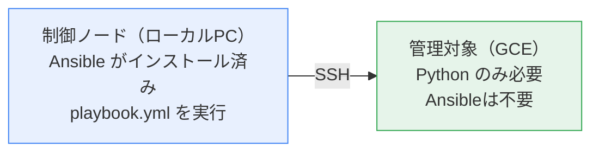
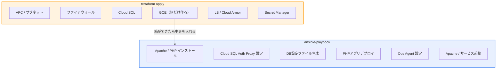
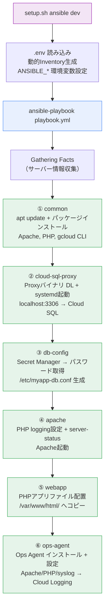
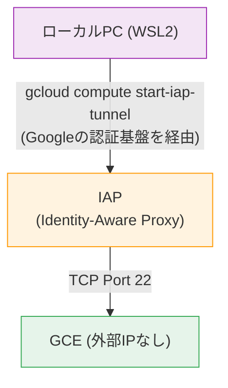

<!-- gdoc: https://docs.google.com/document/d/17vZHCaN1fpoeNLv1BPFH-5YsNpeiPH_WTUfJskvITN0/edit -->
# Ansible 入門ガイド（GCE + Cloud SQL 構築）

<br>

---

<br>

## 1. Ansibleとは

<br>

### 1-1. 一言でいうと

**サーバーの構成（ソフトウェアのインストール・設定・デプロイ）をコード（YAMLファイル）で定義し、コマンド1つでリモートサーバーに自動適用できるツール。**

<br>

### 1-2. 従来の手作業との比較

| | 手作業（SSH + コマンド） | Ansible |
|---|---|---|
| 構築方法 | サーバーにSSHして1つずつコマンド実行 | コードを書いて `ansible-playbook` |
| 再現性 | 手順書が必要、ミスしやすい | コードが手順書そのもの、何度でも同じ結果 |
| 変更管理 | 「誰がいつ何を変えた」が不明 | gitで差分管理 |
| サーバー複製 | 全部やり直し | 同じPlaybookを別サーバーに実行 |
| 差分適用 | 変更箇所を手動で判断 | 自動で差分を検出し、必要な部分だけ適用 |

<br>

### 1-3. エージェントレス構成



- **エージェントレス**: 管理対象サーバーにAnsibleのインストールが不要（Pythonだけで動作）
- Chef や Puppet のようにエージェントの常駐プロセスが不要
- SSH接続さえできれば、どのサーバーでも管理可能

<br>

### 1-4. Terraform との役割分担



| 観点 | Terraform | Ansible |
|---|---|---|
| 対象 | GCPインフラリソース（VPC, GCE, DB等） | GCE**内**のソフトウェア・設定 |
| 例え | 家を建てる（基礎・壁・屋根） | 家具を入れる（設備・内装・引っ越し） |
| 変更時 | `terraform apply`（インフラ変更） | `ansible-playbook`（設定変更） |
| GCE再作成 | 属性によっては発生する | **発生しない** |

> **ポイント:** PHPや設定の変更は Ansible で差分適用するだけで済み、GCEの再作成が不要。

<br>

---

<br>

## 2. 基本概念

<br>

### 2-1. 用語一覧

| 用語 | 意味 | 本構成での該当 |
|---|---|---|
| **制御ノード** | Ansibleを実行するマシン | ローカルPC（WSL2） |
| **管理対象ノード** | Ansibleで管理されるサーバー | GCE（`{prefix}-web`） |
| **Inventory** | 管理対象サーバーの一覧 | `inventory/dev.yml` |
| **Playbook** | 実行する処理の定義ファイル | `playbook.yml` |
| **Role** | 処理をまとめた再利用可能な単位 | `roles/apache/`, `roles/webapp/` 等 |
| **Task** | 1つの処理（1コマンドに相当） | `apt install apache2` に相当 |
| **Handler** | 特定条件で実行される処理 | 設定変更時の `restart apache` |
| **Template** | 変数を埋め込めるファイル | `config.yaml.j2`（Jinja2形式） |
| **Variable** | 環境ごとに変える値 | `group_vars/dev.yml` |
| **Tag** | タスクやロールに付ける目印 | `--tags webapp` で特定ロールのみ実行 |
| **Module** | Ansibleが提供する処理の部品 | `apt`, `copy`, `template`, `service` 等 |
| **冪等性** | 何度実行しても同じ結果になる性質 | Ansibleの最大の特徴 |

<br>

### 2-2. 冪等性（べきとうせい）

```bash
# 1回目: Apache をインストール
$ ansible-playbook playbook.yml
# → changed: apache2をインストールした

# 2回目: 同じPlaybookを再実行
$ ansible-playbook playbook.yml
# → ok: apache2は既にインストール済み（何もしない）
```

- Ansibleは「あるべき状態」を宣言する
- 既にその状態なら何もしない（`ok`）
- 差分がある場合のみ変更する（`changed`）
- **何度実行しても安全** → 「迷ったらもう一回実行」で問題なし

<br>

### 2-3. 実行結果の読み方

```
PLAY [all] ***************************************************************

TASK [Gathering Facts] ***************************************************
ok: [myapp-dev-web]

TASK [common : Update apt cache] *****************************************
ok: [myapp-dev-web]

TASK [common : Install base packages] ************************************
changed: [myapp-dev-web]

TASK [apache : Enable and start Apache] **********************************
ok: [myapp-dev-web]

PLAY RECAP ***************************************************************
myapp-dev-web  :  ok=15   changed=3   unreachable=0   failed=0   skipped=0
```

| ステータス | 意味 | 色 |
|---|---|---|
| `ok` | 既に期待通りの状態（変更なし） | 緑 |
| `changed` | 変更を加えた | 黄 |
| `failed` | 失敗した | 赤 |
| `skipped` | 条件により実行しなかった | 青 |
| `unreachable` | サーバーに接続できなかった | 赤 |

- **`changed=0` が理想**（全部 `ok` = 設定がすべて適用済み）
- **`failed=0` が必須**（失敗がゼロであること）

<br>

---

<br>

## 3. 基本コマンド

<br>

### 3-1. ansible-playbook（メインコマンド）

```bash
# 全ロールを実行（初回セットアップ・フル適用）
ansible-playbook -i inventory/dev.yml playbook.yml

# 特定のタグのみ実行（PHPアプリだけ更新）
ansible-playbook -i inventory/dev.yml playbook.yml --tags webapp

# ドライラン（実際には変更しない）
ansible-playbook -i inventory/dev.yml playbook.yml --check

# 詳細出力（デバッグ用）
ansible-playbook -i inventory/dev.yml playbook.yml -v      # 詳細
ansible-playbook -i inventory/dev.yml playbook.yml -vv     # より詳細
ansible-playbook -i inventory/dev.yml playbook.yml -vvv    # SSH含む最大詳細
```

> **本構成では:** `setup.sh` がこれらを自動で実行するため、通常は `./scripts/setup.sh ansible dev` を使う。

<br>

### 3-2. setup.sh 経由での実行（推奨）

```bash
# 全ロール実行
./scripts/setup.sh ansible dev

# 特定タグのみ実行
./scripts/setup.sh ansible-tag dev webapp
./scripts/setup.sh ansible-tag dev ops-agent
./scripts/setup.sh ansible-tag dev apache
```

`setup.sh` は以下を自動処理する:
- `.env` から変数を読み込み
- 動的にInventoryを生成
- IAP SSH接続に必要な環境変数を設定
- WSL2のworld writableディレクトリ問題を回避

<br>

### 3-3. その他のコマンド

| コマンド | 用途 |
|---|---|
| `ansible --version` | バージョン確認 |
| `ansible-inventory -i inventory/dev.yml --list` | Inventoryの内容を確認 |
| `ansible all -i inventory/dev.yml -m ping` | 接続テスト（SSHで到達できるか） |
| `ansible all -i inventory/dev.yml -m shell -a "uptime"` | アドホックコマンド実行 |

<br>

---

<br>

## 4. YAMLの基礎

<br>

Ansibleの設定ファイルはすべて **YAML形式** で書く。

### 4-1. 基本構文

```yaml
# コメント（#で始まる行）

# 文字列
name: Apache Webサーバー

# 数値
port: 80

# 真偽値
enabled: true

# リスト（配列）
packages:
  - apache2
  - php
  - php-mysql

# リスト（インライン）
packages: [apache2, php, php-mysql]

# 辞書（ハッシュ）
server:
  host: 127.0.0.1
  port: 3306

# 複数行テキスト（|は改行を保持）
description: |
  1行目
  2行目
  3行目
```

<br>

### 4-2. インデントに注意

```yaml
# OK: スペース2個で統一
roles:
  - role: common
    tags: ['common']

# NG: タブ文字は使えない（Ansibleがエラーになる）
roles:
	- role: common    # ← タブ文字はNG
```

- **スペース2個** でインデント（本構成での統一ルール）
- タブ文字は使えない（YAMLの仕様）
- インデントがずれると構文エラーになる

<br>

---

<br>

## 5. Playbook の書き方

<br>

### 5-1. Playbook とは

Playbookは「どのサーバーに」「何をするか」を定義するファイル。

```yaml
# playbook.yml — 本構成のメインPlaybook
---
- hosts: all           # 対象: Inventoryの全サーバー
  become: true         # root権限で実行（sudo相当）
  roles:
    - { role: common,          tags: ['common'] }
    - { role: cloud-sql-proxy, tags: ['cloud-sql-proxy'] }
    - { role: db-config,       tags: ['db-config'] }
    - { role: apache,          tags: ['apache'] }
    - { role: webapp,          tags: ['webapp'] }
    - { role: ops-agent,       tags: ['ops-agent'] }
```

| 項目 | 意味 |
|---|---|
| `hosts: all` | Inventoryに定義された全サーバーが対象 |
| `become: true` | sudo でroot権限として実行（apt install 等に必要） |
| `roles:` | 実行するロールの一覧（上から順に実行） |
| `tags:` | `--tags` オプションで特定ロールのみ実行可能にする |

<br>

### 5-2. タグによる部分実行

```bash
# 全ロール実行（初回）
./scripts/setup.sh ansible dev

# PHPアプリだけ更新
./scripts/setup.sh ansible-tag dev webapp

# Apache設定だけ更新
./scripts/setup.sh ansible-tag dev apache

# 複数タグを指定
ansible-playbook playbook.yml --tags "apache,webapp"
```

タグがないと全ロールが毎回実行されるため、PHPファイルを1つ変えるだけでも全パッケージの確認が走る。タグを使えば **必要な処理だけ高速に実行** できる。

<br>

---

<br>

## 6. Inventory（管理対象の定義）

<br>

### 6-1. Inventoryとは

「どのサーバーを管理するか」を定義するファイル。

```yaml
# inventory/dev.yml
all:
  hosts:
    myapp-dev-web:                   # ホスト名
      ansible_host: myapp-dev-web    # 接続先（GCEインスタンス名）
  children:
    dev:                             # グループ名
      hosts:
        myapp-dev-web:
```

| 項目 | 意味 |
|---|---|
| `all` | 全ホストの親グループ（Ansible標準） |
| `hosts` | 管理対象サーバーの一覧 |
| `ansible_host` | 実際の接続先（IPアドレスやホスト名） |
| `children` | サブグループ（`dev`, `prod` 等の環境別グループ） |

<br>

### 6-2. 本構成での動的Inventory生成

本構成では `setup.sh` が `.env` の値から Inventory を動的に生成する:

```bash
# .envの値
PROJECT_NAME=rubese

# setup.shが生成するInventory（/tmp/ansible-inventory-dev.yml）
all:
  hosts:
    rubese-dev-web:              # ← PROJECT_NAME + env から自動生成
      ansible_host: rubese-dev-web
  children:
    dev:
      hosts:
        rubese-dev-web:
```

**動的生成の理由:** プロジェクト名が変わっても Inventory ファイルの手動編集が不要になる。

<br>

---

<br>

## 7. Role（ロール）の構造

<br>

### 7-1. ロールとは

処理を機能単位にまとめた「パッケージ」。1つのロールが1つの責務を担当する。

```
roles/
├── common/              # ① ベースパッケージ
├── cloud-sql-proxy/     # ② DB接続用Proxy
├── db-config/           # ③ DB設定ファイル
├── apache/              # ④ Webサーバー設定
├── webapp/              # ⑤ PHPアプリデプロイ
└── ops-agent/           # ⑥ 監視・ログ収集
```

<br>

### 7-2. ロールのディレクトリ構成（規約）

```
roles/apache/
├── tasks/
│   └── main.yml          # タスク定義（メイン処理）
├── handlers/
│   └── main.yml          # ハンドラ定義（通知時に実行する処理）
├── templates/
│   ├── 99-logging.ini.j2 # テンプレートファイル（変数埋め込み可）
│   └── status.conf.j2
├── files/                # 静的ファイル（変数埋め込み不要）
├── vars/                 # ロール固有変数
├── defaults/             # デフォルト変数（上書き可）
└── meta/                 # ロール間の依存関係
```

| ディレクトリ | 用途 | 本構成での使用 |
|---|---|---|
| `tasks/` | メイン処理（必須） | 全ロールで使用 |
| `handlers/` | 設定変更時のサービス再起動 | `apache`, `ops-agent` |
| `templates/` | 変数を埋め込めるファイル（`.j2`） | `cloud-sql-proxy`, `db-config`, `apache`, `ops-agent` |
| `files/` | そのままコピーするファイル | `webapp`（PHPファイル） |

> **ファイル名の規約:** 各ディレクトリ内の `main.yml` はAnsibleが自動的に読み込む。

<br>

### 7-3. ロール実行の順序

Playbook の `roles:` に記載した順に**上から下へ順番に実行**される。依存関係を考慮した順序で定義する:

```
① common          → パッケージインストール（Apache, PHP, gcloud CLI）
② cloud-sql-proxy → DB接続用Proxy起動（commonでgcloudが入っている前提）
③ db-config       → DB設定ファイル生成（Proxy起動後に行う）
④ apache          → Apache設定（commonでApacheが入っている前提）
⑤ webapp          → PHPアプリデプロイ（Apacheが設定済みの前提）
⑥ ops-agent       → 監視設定（最後に入れる）
```

<br>

---

<br>

## 8. Task（タスク）の書き方

<br>

### 8-1. 基本構文

```yaml
# roles/common/tasks/main.yml
---
- name: Update apt cache              # タスク名（ログに表示される）
  apt:                                 # 使用するモジュール
    update_cache: yes                  # モジュールのパラメータ
    cache_valid_time: 3600             # キャッシュ有効時間（秒）
```

| 要素 | 意味 |
|---|---|
| `name:` | タスクの説明（ログ出力に使われる、日本語も可） |
| `apt:` | 使用するモジュール名（Ansibleが提供する処理の部品） |
| パラメータ | モジュールに渡す設定値 |

<br>

### 8-2. よく使うモジュール

<br>

#### apt — パッケージインストール

```yaml
- name: Install base packages
  apt:
    name:
      - apache2
      - php
      - php-mysql
    state: present              # present=インストール, absent=削除
    update_cache: yes
```

<br>

#### copy — ファイルコピー（静的ファイル）

```yaml
- name: Deploy PHP application files
  copy:
    src: "{{ item }}"           # files/ ディレクトリからの相対パス
    dest: "/var/www/html/{{ item }}"
    owner: www-data
    group: www-data
    mode: '0644'
  loop:                         # 複数ファイルをループで処理
    - index.php
    - db-check.php
    - db-sample.php
    - db-config.php
    - health
```

<br>

#### template — テンプレートファイル配置（変数埋め込み）

```yaml
- name: Deploy DB config
  template:
    src: db.conf.j2              # templates/ ディレクトリからの相対パス
    dest: /etc/myapp-db.conf
    owner: root
    group: www-data
    mode: '0640'                 # www-dataのみ読み取り可
```

<br>

#### service — サービス管理

```yaml
- name: Enable and start Apache
  service:
    name: apache2
    state: started               # started, stopped, restarted, reloaded
    enabled: yes                 # OS起動時に自動起動
```

<br>

#### get_url — ファイルダウンロード

```yaml
- name: Download Cloud SQL proxy
  get_url:
    url: "https://storage.googleapis.com/cloud-sql-connectors/..."
    dest: /usr/local/bin/cloud-sql-proxy
    mode: '0755'
```

<br>

#### command / shell — コマンド実行

```yaml
# command: シンプルなコマンド実行（パイプ・リダイレクトは使えない）
- name: Fetch DB password from Secret Manager
  command: >
    gcloud secrets versions access latest
    --secret="{{ db_secret_id }}"
    --project="{{ project_id }}"
  register: db_password_result    # 結果を変数に保存
  no_log: true                    # パスワードをログに出さない

# shell: パイプ・リダイレクトが使える
- name: Check proxy status
  shell: systemctl is-active cloud-sql-proxy || true
  register: proxy_status
```

<br>

#### file — ファイル・ディレクトリ操作

```yaml
- name: Create PHP error log file
  file:
    path: /var/log/apache2/php_errors.log
    state: touch                  # touch, directory, absent, link
    owner: www-data
    group: www-data
    mode: '0644'

- name: Remove default index.html
  file:
    path: /var/www/html/index.html
    state: absent                 # ファイルを削除
```

<br>

### 8-3. タスクのオプション

```yaml
- name: Download Cloud SQL proxy
  get_url:
    url: "https://..."
    dest: /usr/local/bin/cloud-sql-proxy
  notify: restart cloud-sql-proxy    # changed時にハンドラを呼ぶ
  when: ansible_os_family == "Debian" # 条件付き実行
  register: download_result          # 結果を変数に保存
  no_log: true                       # 出力をマスク（パスワード等）
```

| オプション | 意味 |
|---|---|
| `notify:` | タスクが `changed` の時、指定したハンドラを実行 |
| `when:` | 条件を満たす時だけ実行 |
| `register:` | タスクの結果を変数に保存（後続タスクで使用可） |
| `no_log: true` | ログにタスクの入出力を表示しない（機密情報向け） |
| `loop:` | リストの各要素に対してタスクを繰り返し実行 |

<br>

---

<br>

## 9. Handler（ハンドラ）

<br>

### 9-1. ハンドラとは

**設定ファイルが変更された時だけサービスを再起動** する仕組み。

```yaml
# roles/apache/tasks/main.yml
- name: Deploy PHP logging config
  template:
    src: 99-logging.ini.j2
    dest: /etc/php/8.2/apache2/conf.d/99-logging.ini
  notify: restart apache           # ← 変更があったらハンドラを呼ぶ

# roles/apache/handlers/main.yml
- name: restart apache             # ← notifyで指定した名前と一致
  service:
    name: apache2
    state: restarted
```

<br>

### 9-2. ハンドラの特徴

| 特徴 | 説明 |
|---|---|
| タスクが `changed` の時だけ実行 | 設定ファイルが変わっていなければ再起動しない |
| Playbook の最後にまとめて実行 | 複数タスクが同じハンドラをnotifyしても1回だけ実行 |
| 不必要な再起動を防ぐ | `ok`（変更なし）の場合、サービスは再起動されない |

```
1回目の実行:
  Deploy PHP config   → changed → notify: restart apache
  Deploy status.conf  → changed → notify: restart apache
  → ハンドラ実行: restart apache（1回だけ）

2回目の実行:
  Deploy PHP config   → ok（変更なし）
  Deploy status.conf  → ok（変更なし）
  → ハンドラ実行されない（再起動も不要）
```

<br>

---

<br>

## 10. Template（テンプレート）と変数

<br>

### 10-1. Jinja2テンプレート

テンプレートファイル（`.j2`）はJinja2構文で変数を埋め込める。

```ini
# templates/db.conf.j2
DB_HOST=127.0.0.1
DB_PORT=3306
DB_NAME={{ db_name }}          # ← 変数が展開される
DB_USER={{ db_user }}
DB_PASSWORD={{ db_password }}
```

テンプレートは `template` モジュールで配置すると、変数が実際の値に置換される:

```ini
# /etc/myapp-db.conf（GCE上に生成されるファイル）
DB_HOST=127.0.0.1
DB_PORT=3306
DB_NAME=rubese
DB_USER=rubese-app
DB_PASSWORD=tusZo1TnC8M+SxsFYGOSZzGRjJJRS+Hp
```

<br>

### 10-2. テンプレート vs 静的ファイル

| | template（`.j2`） | copy（`files/`） |
|---|---|---|
| 変数埋め込み | できる（`{{ var }}`） | できない |
| 配置先 | `templates/` ディレクトリ | `files/` ディレクトリ |
| 用途 | 設定ファイル（環境ごとに値が変わる） | アプリケーションファイル（どの環境でも同じ） |
| 例 | `cloud-sql-proxy.service.j2`, `db.conf.j2` | `index.php`, `db-check.php` |

<br>

### 10-3. 変数の定義場所と優先順位

変数はいくつかの場所で定義でき、優先順位がある:

```
優先度（高い方が勝つ）:
  ① --extra-vars（コマンドライン引数）  ← setup.sh がここで渡す
  ② Playbook の vars:
  ③ group_vars/dev.yml（グループ変数）
  ④ group_vars/all.yml（全環境共通変数）
  ⑤ roles/xxx/defaults/main.yml（デフォルト値）
```

本構成では `setup.sh` が `--extra-vars` で変数を渡すため、`group_vars/` の値は上書きされる:

```bash
# setup.sh が実行するコマンド（イメージ）
ansible-playbook playbook.yml \
  --extra-vars "project_id=your-project prefix=rubese-dev \
    cloudsql_connection_name=your-project:asia-northeast1:rubese-dev-db \
    db_secret_id=rubese-dev-db-password db_name=rubese db_user=rubese-app"
```

<br>

### 10-4. 変数の定義ファイル

<br>

#### group_vars/all.yml — 全環境共通変数

```yaml
# ソフトウェアバージョン
cloud_sql_proxy_version: v2.14.3
cloud_sql_proxy_bin: /usr/local/bin/cloud-sql-proxy

# パス
apache_document_root: /var/www/html
php_error_log: /var/log/apache2/php_errors.log
db_config_path: /etc/myapp-db.conf
```

<br>

#### group_vars/dev.yml — dev環境変数

```yaml
env: dev
prefix: myapp-dev
project_id: your-gcp-project-id
cloudsql_connection_name: "your-gcp-project-id:asia-northeast1:myapp-dev-db"
db_secret_id: myapp-dev-db-password
db_name: myapp
db_user: myapp-app
```

> **注意:** `setup.sh` 経由で実行する場合、`project_id`, `prefix`, `db_name` 等は `--extra-vars` で上書きされるため、`group_vars` の値はフォールバック用。

<br>

---

<br>

## 11. フォルダ構成の説明（本構成）

<br>

### 11-1. 全体構成

```
terraform/ansible/
├── ansible.cfg                     ← SSH接続設定（WSL2ではsetup.shが代替）
├── playbook.yml                    ← メインPlaybook（ロール呼び出し）
├── inventory/                      ← 環境別ホスト定義
│   ├── dev.yml                     ←   devサーバー
│   └── prod.yml                    ←   prodサーバー
├── group_vars/                     ← 環境別変数
│   ├── all.yml                     ←   全環境共通（パス、バージョン）
│   ├── dev.yml                     ←   dev用（接続先、DB名等）
│   └── prod.yml                    ←   prod用
└── roles/                          ← ロール（処理の単位）
    ├── common/                     ←   ① ベースパッケージ
    │   └── tasks/main.yml
    ├── cloud-sql-proxy/            ←   ② DB接続Proxy
    │   ├── tasks/main.yml
    │   └── templates/cloud-sql-proxy.service.j2
    ├── db-config/                  ←   ③ DB設定ファイル生成
    │   ├── tasks/main.yml
    │   └── templates/db.conf.j2
    ├── apache/                     ←   ④ Webサーバー設定
    │   ├── tasks/main.yml
    │   ├── handlers/main.yml
    │   └── templates/
    │       ├── 99-logging.ini.j2
    │       └── status.conf.j2
    ├── webapp/                     ←   ⑤ PHPアプリデプロイ
    │   ├── tasks/main.yml
    │   └── files/
    │       ├── db-config.php
    │       ├── index.php
    │       ├── db-check.php
    │       ├── db-sample.php
    │       └── health
    └── ops-agent/                  ←   ⑥ 監視・ログ収集
        ├── tasks/main.yml
        ├── handlers/main.yml
        └── templates/config.yaml.j2
```

<br>

### 11-2. Ansibleの実行フロー



<br>

---

<br>

## 12. 各ロールの詳細

<br>

### 12-1. common — ベースパッケージ

**役割:** GCEに必要なパッケージをすべてインストールする。

```yaml
# roles/common/tasks/main.yml
---
- name: Update apt cache
  apt:
    update_cache: yes
    cache_valid_time: 3600          # 1時間以内なら再取得しない

- name: Install base packages
  apt:
    name:
      # Webサーバー + PHP
      - apache2
      - php
      - libapache2-mod-php
      - php-mysql
      - php-json
      # ユーティリティ
      - jq
      - apt-transport-https
      - ca-certificates
      - gnupg
      - curl
    state: present

# gcloud CLI のインストール（GPGキー追加 → リポジトリ追加 → インストール）
- name: Add gcloud GPG key
  # ...

- name: Add gcloud repository
  # ...

- name: Install gcloud CLI
  apt:
    name: google-cloud-cli
    state: present
```

| インストールされるもの | 用途 |
|---|---|
| `apache2` | Webサーバー |
| `php`, `libapache2-mod-php` | PHP実行環境 |
| `php-mysql` | PHPからMySQLへの接続 |
| `jq` | JSONパーサー（スクリプト用） |
| `google-cloud-cli` | Secret Managerアクセスやgcloudコマンドの実行 |

<br>

### 12-2. cloud-sql-proxy — DB接続Proxy

**役割:** Cloud SQL Auth Proxyをインストールし、systemdサービスとして常駐起動する。

```
アプリ (PHP)
  │
  ▼ localhost:3306
Cloud SQL Auth Proxy（GCE内で常駐）
  │
  ▼ Private IP + TLS暗号化
Cloud SQL (MySQL 8.0)
```

**systemdサービスのテンプレート:**

```ini
# templates/cloud-sql-proxy.service.j2
[Unit]
Description=Cloud SQL Auth Proxy
After=network.target

[Service]
Type=simple
ExecStart={{ cloud_sql_proxy_bin }} \
  --private-ip \
  --port=3306 \
  {{ cloudsql_connection_name }}
Restart=always
RestartSec=5
User=www-data

[Install]
WantedBy=multi-user.target
```

| 設定 | 意味 |
|---|---|
| `--private-ip` | Cloud SQLにPrivate IPで接続（外部IP不使用） |
| `--port=3306` | localhost:3306 で待ち受け |
| `Restart=always` | プロセスが落ちても自動再起動 |
| `User=www-data` | Apache実行ユーザーと同じ権限で動作 |

<br>

### 12-3. db-config — DB設定ファイル生成

**役割:** Secret ManagerからDBパスワードを取得し、アプリ用の設定ファイルを生成する。

```yaml
# roles/db-config/tasks/main.yml
---
- name: Fetch DB password from Secret Manager
  command: >
    gcloud secrets versions access latest
    --secret="{{ db_secret_id }}"
    --project="{{ project_id }}"
  register: db_password_result      # 結果を変数に保存
  changed_when: false               # 毎回changedにならないようにする
  no_log: true                      # パスワードをログに出さない

- name: Create DB config file
  template:
    src: db.conf.j2
    dest: "{{ db_config_path }}"    # /etc/myapp-db.conf
    owner: root
    group: www-data
    mode: '0640'                    # root:www-data のみ読み取り可
  vars:
    db_password: "{{ db_password_result.stdout }}"
```

**セキュリティポイント:**

| 対策 | 実装 |
|---|---|
| パスワードをコードに含めない | Secret Managerから実行時に取得 |
| ログにパスワードを出さない | `no_log: true` |
| 設定ファイルのアクセス制限 | `0640`（root:www-data のみ読み取り可） |

<br>

### 12-4. apache — Webサーバー設定

**役割:** PHPのログ設定、server-status（メトリクス収集用）の有効化、Apache起動。

```yaml
# roles/apache/tasks/main.yml
---
- name: Deploy PHP logging configuration
  template:
    src: 99-logging.ini.j2
    dest: /etc/php/8.2/apache2/conf.d/99-logging.ini
  notify: restart apache

- name: Create PHP error log file
  file:
    path: "{{ php_error_log }}"
    state: touch
    owner: www-data
    group: www-data

- name: Deploy Apache server-status config
  template:
    src: status.conf.j2
    dest: /etc/apache2/conf-enabled/status.conf
  notify: restart apache

- name: Enable Apache status module
  command: a2enmod status
  notify: restart apache

- name: Enable and start Apache
  service:
    name: apache2
    state: started
    enabled: yes
```

**PHP ログ設定（99-logging.ini.j2）:**

```ini
log_errors = On
error_log = {{ php_error_log }}
error_reporting = E_ALL & ~E_DEPRECATED & ~E_STRICT
```

**server-status設定（status.conf.j2）:**

```apache
<IfModule mod_status.c>
    <Location /server-status>
        SetHandler server-status
        Require local                   # localhostからのみアクセス可
    </Location>
</IfModule>
```

- Ops AgentがApacheのメトリクスを収集するためのエンドポイント
- `Require local` で外部からのアクセスを防止

<br>

### 12-5. webapp — PHPアプリデプロイ

**役割:** デモPHPアプリケーションファイルをApacheのドキュメントルートに配置する。

```yaml
# roles/webapp/tasks/main.yml
---
- name: Remove default index.html
  file:
    path: "{{ apache_document_root }}/index.html"
    state: absent

- name: Deploy application files
  copy:
    src: "{{ item }}"
    dest: "{{ apache_document_root }}/{{ item }}"
    owner: www-data
    group: www-data
    mode: '0644'
  loop:
    - index.php
    - db-check.php
    - db-sample.php
    - db-config.php
    - health
```

**デプロイされるファイル:**

| ファイル | URL | 内容 |
|---|---|---|
| `index.php` | `/` | サーバー情報 + DB接続ステータス |
| `db-check.php` | `/db-check.php` | Proxy稼働確認 + DB一覧・テーブル一覧 |
| `db-sample.php` | `/db-sample.php` | メモ帳CRUDアプリ |
| `db-config.php` | — | DB接続ヘルパー（内部 include 用） |
| `health` | `/health` | LBヘルスチェック用（`OK` を返す） |

> **PHPの変更をデプロイするには:** ローカルの `roles/webapp/files/` のPHPを編集し `./scripts/setup.sh ansible-tag dev webapp` を実行するだけ。GCE再作成は不要。

<br>

### 12-6. ops-agent — 監視・ログ収集

**役割:** Google Cloud Ops Agentをインストールし、ログ収集・メトリクス収集を設定する。

```
GCE内:
  Apache access.log  ──┐
  Apache error.log   ──┤
  PHP php_errors.log ──┼→ Ops Agent ──→ Cloud Logging
  syslog / auth.log  ──┤
  CPU / メモリ / ディスク ┘         ──→ Cloud Monitoring
```

**設定ファイル（config.yaml.j2）の構造:**

```yaml
logging:
  receivers:
    apache_access:
      type: apache_access
      include_paths: [/var/log/apache2/access.log]
    apache_error:
      type: apache_error
      include_paths: [/var/log/apache2/error.log]
    php_errors:
      type: files
      include_paths: [/var/log/apache2/php_errors.log]
    syslog:
      type: files
      include_paths:
        - /var/log/syslog
        - /var/log/auth.log

  processors:
    php_label:
      type: modify_fields
      fields:
        labels."app":
          static_value: php

  service:
    pipelines:
      apache_access:
        receivers: [apache_access]
      apache_error:
        receivers: [apache_error]
      php_errors:
        receivers: [php_errors]
        processors: [php_label]
      syslog:
        receivers: [syslog]

metrics:
  receivers:
    apache:
      type: apache
      server_status_url: http://127.0.0.1/server-status?auto
  service:
    pipelines:
      apache:
        receivers: [apache]
```

| 収集対象 | Cloud Logging での絞り込み |
|---|---|
| Apache アクセスログ | ログ名: `apache_access` |
| Apache エラーログ | ログ名: `apache_error` |
| PHP エラーログ | `labels.app="php"` |
| システムログ | ログ名: `syslog` |
| Apache メトリクス | Monitoring → Metrics Explorer → `apache` |

<br>

---

<br>

## 13. SSH接続の仕組み

<br>

### 13-1. IAP SSH トンネル



- GCEに外部IPがないため、通常のSSH（`ssh user@ip`）では接続できない
- IAP トンネルを使うことで、Googleの認証基盤を経由して安全にSSH接続
- Ansibleは `ProxyCommand` でこのトンネルを自動的に使用

<br>

### 13-2. SSH接続設定

`setup.sh` が以下の環境変数を設定してAnsibleに渡す:

```bash
# SSHユーザー（.env の GCE_SSH_USER or whoami）
export ANSIBLE_REMOTE_USER="satouser"

# ホストキー確認を無効化（GCE再作成で変わるため）
export ANSIBLE_HOST_KEY_CHECKING=False

# IAP トンネル経由のSSH接続
export ANSIBLE_SSH_ARGS="-i ~/.ssh/google_compute_engine \
  -o ProxyCommand=\"gcloud compute start-iap-tunnel %h 22 \
  --listen-on-stdin --zone=asia-northeast1-a --quiet\""

# パイプライン有効化（高速化）
export ANSIBLE_PIPELINING=True
```

| 設定 | 意味 |
|---|---|
| `ANSIBLE_REMOTE_USER` | GCEへのSSHユーザー名 |
| `ANSIBLE_SSH_ARGS` | SSH接続オプション（IAP ProxyCommand + 秘密鍵指定） |
| `ANSIBLE_HOST_KEY_CHECKING=False` | ホスト鍵の検証をスキップ |
| `ANSIBLE_PIPELINING=True` | 複数タスクをまとめて転送（高速化） |

<br>

### 13-3. SSH鍵の準備（初回のみ）

```bash
# SSH鍵を生成（初回のみ、パスフレーズは空Enterで設定しない）
./scripts/setup.sh ssh dev
```

このコマンドは `gcloud compute ssh` を実行し、`~/.ssh/google_compute_engine` にSSH鍵を自動生成する。

<br>

---

<br>

## 14. 実践: よくある操作パターン

<br>

### 14-1. 初回セットアップ（全ロール実行）

```bash
# 前提: terraform apply 完了済み、SSH鍵生成済み
./scripts/setup.sh ansible dev
# → 約5分（パッケージインストール + 設定）
```

<br>

### 14-2. PHPアプリの更新

```bash
# 1. ローカルでPHPファイルを編集
vi terraform/ansible/roles/webapp/files/index.php

# 2. webappロールだけ実行
./scripts/setup.sh ansible-tag dev webapp
# → 約10秒（ファイルコピーのみ）
```

<br>

### 14-3. Apache設定の変更

```bash
# 1. テンプレートを編集
vi terraform/ansible/roles/apache/templates/99-logging.ini.j2

# 2. apacheロールを実行（ハンドラでApache自動再起動）
./scripts/setup.sh ansible-tag dev apache
```

<br>

### 14-4. Ops Agent設定の変更

```bash
# 1. 設定テンプレートを編集
vi terraform/ansible/roles/ops-agent/templates/config.yaml.j2

# 2. ops-agentロールを実行（ハンドラでOps Agent自動再起動）
./scripts/setup.sh ansible-tag dev ops-agent
```

<br>

### 14-5. 新しいロールを追加する

```bash
# 1. ロールのディレクトリ構成を作成
mkdir -p terraform/ansible/roles/newrole/{tasks,templates,files,handlers}

# 2. タスクを定義
cat > terraform/ansible/roles/newrole/tasks/main.yml <<'EOF'
---
- name: Do something
  command: echo "Hello from new role"
EOF

# 3. playbook.yml にロールを追加
# roles:
#   ...既存ロール...
#   - { role: newrole, tags: ['newrole'] }

# 4. 実行
./scripts/setup.sh ansible-tag dev newrole
```

<br>

---

<br>

## 15. トラブルシューティング

<br>

### 15-1. SSH接続エラー: Permission denied (publickey)

**症状:**

```
Permission denied (publickey).
```

**原因と対処:**

| 確認ポイント | 対処 |
|---|---|
| SSH鍵が未生成 | `./scripts/setup.sh ssh dev` を実行（初回のみ） |
| SSHユーザー名の不一致 | `.env` の `GCE_SSH_USER` を確認。通常は `whoami` の値 |
| GCE再作成後 | 再度 `./scripts/setup.sh ssh dev` を実行してホスト鍵を更新 |

<br>

### 15-2. ansible.cfg が無視される（WSL2）

**症状:**

```
[WARNING]: Ansible is being run in a world writable directory,
ignoring it as an ansible.cfg source.
```

**原因:** WSL2のWindowsマウント（`/mnt/d/`）は `777` パーミッション。

**対処:** `setup.sh` が `ANSIBLE_*` 環境変数で設定を注入するため、対処不要（この警告は無視してよい）。

<br>

### 15-3. `--tags` でタスクが実行されない

**症状:** `ansible-tag dev webapp` でも `Gathering Facts` のみで終了。

**原因:** `playbook.yml` のロール定義にタグが付いていない。

**対処:**

```yaml
# NG: タグなし
roles:
  - webapp

# OK: タグあり
roles:
  - { role: webapp, tags: ['webapp'] }
```

<br>

### 15-4. テンプレートファイルが見つからない

**症状:**

```
Could not find or access 'myapp-db.conf.j2'
```

**原因:** タスクの `src:` で指定した名前と `templates/` 内の実際のファイル名が不一致。

**対処:** ファイル名をプロジェクト名に依存しない汎用名にする。

```yaml
# NG: プロジェクト固有名
src: rubese-db.conf.j2

# OK: 汎用名
src: db.conf.j2
```

<br>

### 15-5. Ops Agent 起動失敗

**症状:**

```
Unable to restart service google-cloud-ops-agent
```

**確認方法:**

```bash
# GCEにSSHしてログを確認
./scripts/setup.sh ssh dev
sudo journalctl -xeu google-cloud-ops-agent --no-pager | tail -30
```

**よくある原因:**

| 原因 | 対処 |
|---|---|
| `filter_pattern` は `files` レシーバーで無効 | `filter_pattern` を削除 |
| YAML構文エラー | `config.yaml.j2` のインデントを確認 |
| ログファイルが存在しない | `include_paths` のパスを確認 |

<br>

### 15-6. CRLF改行エラー（WSL2）

**症状:**

```
bash: ./scripts/setup.sh: cannot execute: required file not found
```

**対処:**

```bash
tr -d '\r' < scripts/setup.sh > /tmp/setup.sh && cp /tmp/setup.sh scripts/setup.sh
```

<br>

### 15-7. 接続タイムアウト

**症状:** Ansibleの実行がタイムアウトする。

**確認:**

```bash
# まずSSHで直接接続できるか確認
./scripts/setup.sh ssh dev

# IAP API が有効か確認
gcloud services list --enabled --filter="name:iap.googleapis.com"
```

<br>

---

<br>

## 16. ベストプラクティス

<br>

### 16-1. タスクの書き方

| ルール | 説明 |
|---|---|
| `name:` は必ず付ける | ログで何をしているか分かるようにする |
| 冪等なモジュールを優先 | `command` / `shell` より `apt`, `copy`, `template` を使う |
| `no_log: true` で機密保護 | パスワード等を扱うタスクには必ず付ける |
| `changed_when` を適切に設定 | `command` / `shell` はデフォルトで常に `changed` になる |

<br>

### 16-2. ファイル管理

| ルール | 説明 |
|---|---|
| 変数が必要 → `template` | `.j2` ファイルを `templates/` に配置 |
| 変数不要 → `copy` | 静的ファイルを `files/` に配置 |
| テンプレートに汎用名を使う | プロジェクト名をファイル名に入れない |
| パーミッションを明示する | `owner`, `group`, `mode` を必ず指定 |

<br>

### 16-3. 変数管理

| ルール | 説明 |
|---|---|
| パスワードはSecret Managerに | コードにハードコーディングしない |
| 環境差は `group_vars/` で吸収 | dev/prod の差分を変数で管理 |
| `setup.sh` の `--extra-vars` を活用 | `.env` から動的に変数を注入 |

<br>

---

<br>

## 17. Ansible と他ツールの比較

<br>

| 特徴 | Ansible | Chef | Puppet | Shell Script |
|---|---|---|---|---|
| 言語 | YAML | Ruby | Ruby DSL | Bash |
| エージェント | 不要 | 必要 | 必要 | 不要 |
| 冪等性 | 組み込み | 組み込み | 組み込み | 自前実装が必要 |
| 学習コスト | 低い | 高い | 中程度 | 低い |
| 大規模向け | △（push型） | ○（pull型） | ○（pull型） | × |
| 適用方式 | Push（ローカルから実行） | Pull（定期実行） | Pull（定期実行） | Push |

**Ansibleを選んだ理由（本構成）:**

- GCE 1台構成 → エージェントレスのPush型で十分
- YAML → 学習コストが低い
- `setup.sh` に統合しやすい
- Terraform と同じ HashiCorp / IaC の思想で補完関係

<br>

---

<br>

## 18. コマンドリファレンス

<br>

### 18-1. setup.sh 経由（推奨）

| コマンド | 用途 |
|---|---|
| `./scripts/setup.sh ansible dev` | dev環境に全ロール実行 |
| `./scripts/setup.sh ansible prod` | prod環境に全ロール実行 |
| `./scripts/setup.sh ansible-tag dev webapp` | webappロールのみ実行 |
| `./scripts/setup.sh ansible-tag dev apache` | apacheロールのみ実行 |
| `./scripts/setup.sh ansible-tag dev ops-agent` | ops-agentロールのみ実行 |
| `./scripts/setup.sh ssh dev` | SSH鍵生成・接続テスト |

<br>

### 18-2. ansible-playbook 直接実行

| コマンド | 用途 |
|---|---|
| `ansible-playbook -i inventory/dev.yml playbook.yml` | 全ロール実行 |
| `ansible-playbook ... --tags webapp` | 特定タグのみ |
| `ansible-playbook ... --tags "apache,webapp"` | 複数タグ |
| `ansible-playbook ... --check` | ドライラン |
| `ansible-playbook ... --diff` | 変更差分を表示 |
| `ansible-playbook ... -v` | 詳細ログ |
| `ansible-playbook ... --list-tasks` | 実行されるタスク一覧 |
| `ansible-playbook ... --list-tags` | 使用可能なタグ一覧 |

<br>

### 18-3. デバッグ・確認

| コマンド | 用途 |
|---|---|
| `ansible --version` | バージョン確認 |
| `ansible-inventory -i inventory/dev.yml --list` | Inventory内容確認 |
| `ansible all -i inventory/dev.yml -m ping` | 接続テスト |
| `ansible all -i inventory/dev.yml -m shell -a "uptime"` | アドホックコマンド |
| `ansible all -i inventory/dev.yml -m setup` | サーバー情報取得 |
